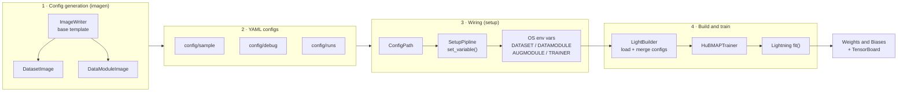
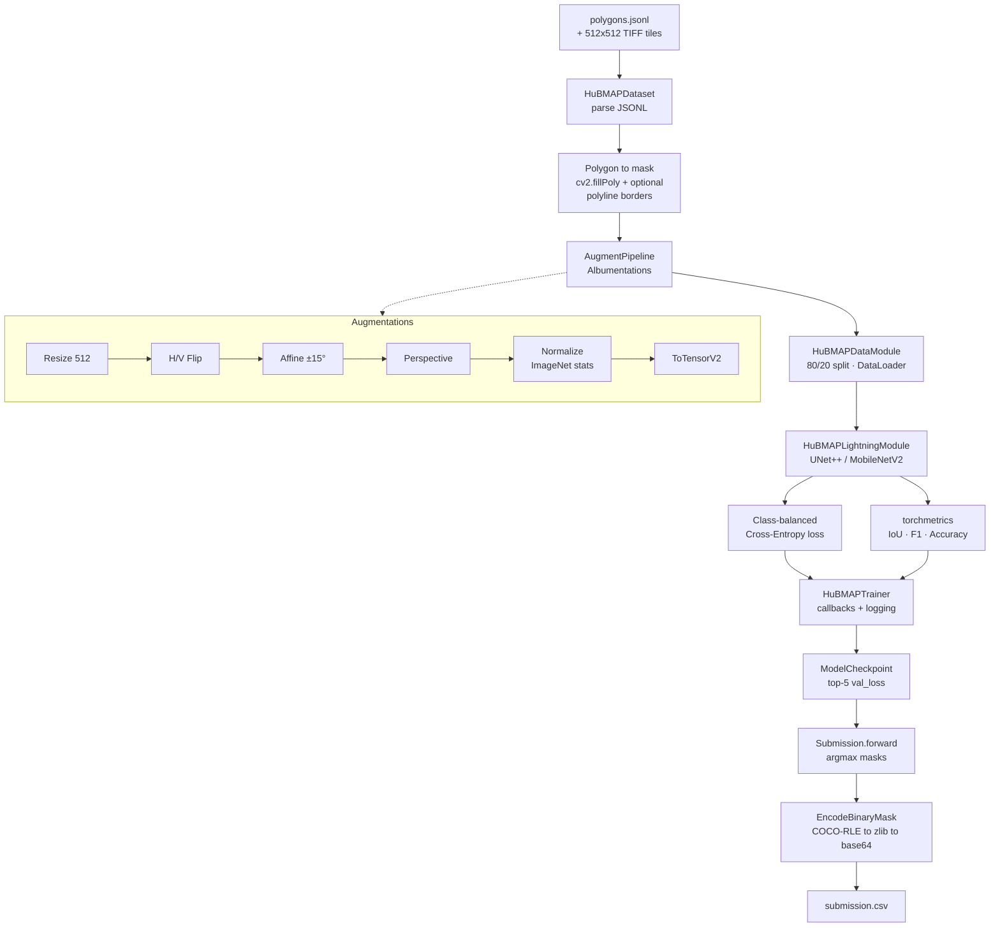
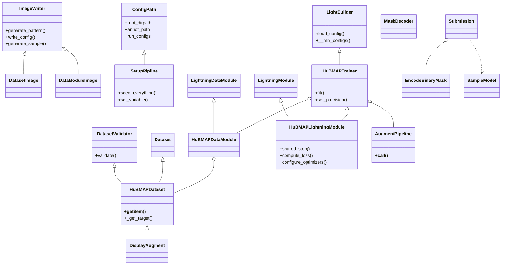

<div align="center">

# 🩸 HuBMAP — Hacking the Human Vasculature

### A config‑driven PyTorch Lightning framework for microvascular instance segmentation in human kidney histology

<em>Segmenting blood‑vessel structures in PAS‑stained renal tissue to help build the Vasculature Common Coordinate Framework (VCCF)</em>

<br/>

<!-- Result Card -->


</div>

> [!NOTE]
> **What this repository is.** An engineering‑first, configuration‑driven training framework built from scratch for the Kaggle *HuBMAP — Hacking the Human Vasculature* (2023) competition. The emphasis of this case study is **ML system design**: a clean, modular, YAML‑configurable PyTorch Lightning pipeline covering data modelling, polygon→mask rasterization, augmentation, training, experiment tracking, and competition‑format submission encoding.
>
> **On results.** This repository does not ship a trained model or a recorded leaderboard score — the submission path currently uses a placeholder `SampleModel`. Every metric, formula, and dataset fact below is traceable to the notebooks, the pipeline code, or the [official competition pages](https://www.kaggle.com/competitions/hubmap-hacking-the-human-vasculature). Nothing is invented to look impressive. The *Results* section reports the metrics the pipeline **instruments**, not scores it claims.

---

## 📑 Table of Contents

- [Abstract](#-abstract)
- [Clinical Problem & Significance](#-clinical-problem--significance)
- [Dataset](#-dataset)
- [Evaluation Metric](#-evaluation-metric)
- [System Design](#-system-design)
- [Pipeline Architecture](#-pipeline-architecture)
- [Class Architecture](#-class-architecture)
- [Methodology Deep‑Dive](#-methodology-deep-dive)
- [Domain Formulas](#-domain-formulas)
- [Results & Conclusions](#-results--conclusions)
- [Repository Structure](#-repository-structure)
- [Reproduce](#-reproduce)
- [References](#-references)

---

## 🧭 Abstract

The proper functioning of human organs depends on the spatial organization of ~37 trillion cells. Mapping them requires a navigation system, and the **Vasculature Common Coordinate Framework (VCCF)** uses the body's blood vasculature — down to individual capillaries — as that coordinate system. Gaps in our knowledge of **microvasculature** therefore translate directly into gaps in the VCCF. The HuBMAP 2023 competition asked participants to **automatically segment microvascular structures (blood vessels)** in Periodic acid‑Schiff (PAS) stained whole‑slide images of healthy human kidney.

This repository implements a **from‑scratch, config‑driven training framework** for that task. It rasterizes polygonal annotations into semantic (or instance) masks, applies a reproducible Albumentations pipeline, trains a `segmentation-models-pytorch` **UNet++ / MobileNetV2** network under **PyTorch Lightning** with class‑balanced cross‑entropy, tracks IoU / F1 / accuracy via `torchmetrics`, and encodes predictions in the competition's **COCO‑RLE → zlib → base64** submission format. The design goal is a maintainable, template‑generated, environment‑variable‑wired ML system — not a one‑off notebook.

---

## 🔬 Clinical Problem & Significance

| | |
|---|---|
| **Disease area** | Renal (kidney) tissue architecture — nephrology / digital pathology |
| **Modality** | Whole‑Slide Images (WSI) of **PAS‑stained** histology, tiled to 512×512 |
| **Target biology** | **Microvasculature** — arterioles, capillaries and venules within the renal cortex/medulla |
| **Why it matters** | Microvessels are the *addressing system* of the VCCF; segmenting them fills the gaps needed for a **Human Reference Atlas (HRA)** |

Renal tissue contains **glomeruli** (balls of capillary loops that begin the nephron) and a dense network of **peritubular capillaries** and **vasa recta**. Reliable, automated delineation of these vessels from stained tissue lets researchers turn raw slide data into structured, machine‑readable vascular maps — a prerequisite for studying how cell‑to‑cell relationships affect health. In this competition, `glomerulus` regions are explicitly **excluded** (predictions overlapping them count as false positives), and ambiguous structures are marked `unsure`.

<div align="center">

&nbsp;&nbsp;

<br/>
<sub><em>Left: a 512×512 PAS‑stained kidney tile with its blood‑vessel mask overlaid. Right: image and the mask rasterized from polygon annotations. Rendered by this project's notebooks on the competition sample data.</em></sub>
</div>

---

## 🗂 Dataset

The competition data comprises tiles extracted from **14 Whole‑Slide Images** and organized into three datasets:

| Dataset | WSIs | Annotations | Purpose |
|---|---|---|---|
| **Dataset 1** | subset of 5 | **Expert‑reviewed** polygons | Primary supervised signal; all test tiles originate here |
| **Dataset 2** | same 5 WSIs | Sparse, **not** expert‑reviewed | Extra (noisy) supervision / pretraining |
| **Dataset 3** | 9 additional WSIs | **Unannotated** | Semi‑/self‑supervised opportunities |

**Data split of the 5 annotated WSIs:** 2 train · 2 public test · 1 private test. There are **~650 tiles** in the full hidden test set (this is a Kaggle **code competition**).

**Observed in this project's data loading:**

| Quantity | Value | Source |
|---|---|---|
| Total tiles (`tile_meta.csv`) | **7,033** | notebook output |
| Annotated images (`polygons.jsonl`) | **1,633** | notebook output |
| Tile size | **512 × 512**, TIFF | competition data page |
| Annotation classes | `blood_vessel` (target), `glomerulus` (excluded), `unsure` | `polygons.jsonl` |
| Donor metadata | age, sex, race, height, weight, BMI (`wsi_meta.csv`) | notebook EDA |

<div align="center">

&nbsp;&nbsp;

<br/>
<sub><em>Left: number of tiles per dataset. Right: donor sex/race distribution across the annotated WSIs. Aggregate statistics only — no patient‑identifiable data.</em></sub>
</div>

> [!IMPORTANT]
> **No competition data, medical images, or model weights are committed to this repository.** The `data/`, `models/`, and `env/` directories are git‑ignored. The tiles shown above are figures rendered by the project's own notebooks; the raw dataset must be obtained from Kaggle under its own license.

---

## 📐 Evaluation Metric

Submissions are scored by **Average Precision (AP) over confidence scores**, computed exactly as in the **OpenImages Instance Segmentation Challenge but with a single class** (`blood_vessel`). A predicted mask matches a ground‑truth mask when their **Intersection‑over‑Union ≥ 0.6** (a *single* IoU threshold, not a COCO‑style average over thresholds).

$$
\mathrm{IoU}(A, B) = \frac{\lvert A \cap B \rvert}{\lvert A \cup B \rvert}, \qquad
\mathrm{AP} = \sum_{n} \left( R_n - R_{n-1} \right) P_n
$$

where predictions are ranked by descending confidence, and $P_n$, $R_n$ are the precision and recall after the $n$‑th prediction. A prediction is a **true positive** when it matches an unclaimed ground‑truth vessel at $\mathrm{IoU} \ge 0.6$; predictions inside `glomerulus` regions are **false positives**.

---

## 🧱 System Design

The framework is built around a **template → config → environment → builder** flow. Nothing is hard‑coded: dataset semantics, augmentation, and trainer behaviour are all declared in YAML that is *generated* from Python "image" templates, then loaded and merged at runtime.



**Why this shape.** Separating *what to run* (YAML) from *how to run it* (builders) means a new experiment is a new config file, not a code edit. `sample` configs document the schema, `debug` configs run fast sanity checks (`fast_dev_run`, spatial augment previews), and `runs` configs carry real hyper‑parameters.

---

## 🧬 Pipeline Architecture

End‑to‑end flow from raw polygons to a competition submission:



---

## 🏛 Class Architecture

The codebase is organized into four cohesive packages — `imagen` (config templates), `setup` (paths/wiring), `lightning` (data + model + trainer), and `submission` (encoding). Key inheritance and composition:



---

## 🔧 Methodology Deep‑Dive

### Data modelling & mask rasterization
`HuBMAPDataset` parses `polygons.jsonl` and rasterizes each annotation with `cv2.fillPoly`. A **config head** switches behaviour:

- **`instance: false`** → all vessels are burned into a single **semantic** mask (label per class).
- **`instance: true`** → one mask **per** vessel, producing an instance target list.
- **`border` class** → optional `cv2.polylines` outline with configurable `thickness`; `multiborder` gives borders a distinct label. This lets the network learn to separate touching vessels — a classic trick for instance‑aware semantic segmentation.

A `DatasetValidator` mix‑in type‑checks every argument (paths, split ratio, stage) before construction — fail fast, fail loud.

### Augmentation
`AugmentPipeline` (Albumentations) composes: `Resize(512)` → `HorizontalFlip` → `VerticalFlip` → `Affine(rotate ±15°, reflect border)` → `Perspective(0.05–0.25)` → `Normalize(ImageNet mean/std)` → `ToTensorV2`. Spatial transforms are toggled by config; a `debug_mode` short‑circuits normalization so masks can be previewed via `DisplayAugment`.

### Model & training
- **Architecture:** `smp.UnetPlusPlus(encoder_name="mobilenet_v2", encoder_depth=5, classes=3)` — a UNet++ decoder over a lightweight MobileNetV2 encoder (background / blood_vessel / border).
- **Loss:** `CrossEntropyLoss` with **per‑batch class weights** from `sklearn.utils.class_weight.compute_class_weight("balanced", …)`, addressing the heavy background‑vs‑vessel imbalance.
- **Metrics:** `torchmetrics` **JaccardIndex (IoU, macro)**, **FBetaScore (F1, micro)**, **Accuracy (micro)**.
- **Optimizer / schedule:** **Adam** + **ReduceLROnPlateau** (`patience=5`, monitors `val_loss`).
- **Callbacks:** `ModelCheckpoint` (top‑5 by `val_loss`), `EarlyStopping` (`patience=5`), `LearningRateMonitor`.
- **Trainer:** PyTorch Lightning, TF32 matmul (`precision="medium"`), `max_epochs=115`, `min_epochs=15`, seeded for determinism.
- **Tracking:** Weights & Biases (`wandb.watch`) + TensorBoard.

### Submission encoding
`EncodeBinaryMask` converts each predicted binary mask to Fortran‑order `uint8`, encodes it with the **COCO mask RLE API**, **zlib**‑compresses (best compression), and **base64**‑encodes it — emitting the required `0 {confidence} {EncodedMask}` prediction strings into `submission.csv`.

> [!WARNING]
> **Honest scope.** The provided `Submission` uses a `SampleModel` that emits random masks — a working I/O harness, not a trained predictor. The winning solutions for this competition used **detection / instance‑segmentation** frameworks (RTMDet, YOLOv8‑seg, Mask R‑CNN / HTC / DetectoRS via MMDetection & Detectron2) with heavy ensembling. This repository is a **semantic‑segmentation baseline framework**, and is documented as such.

---

## 🧮 Domain Formulas

The loss and metrics **actually used** in `HuBMAPLightningModule`:

**Class‑balanced Cross‑Entropy** (per‑batch `balanced` weights, softmax over $C$ classes):

$$
w_c = \frac{N}{C \cdot n_c}, \qquad
\mathcal{L}_{\mathrm{CE}} = -\frac{1}{N}\sum_{i=1}^{N} w_{y_i}\,\log\frac{e^{z_{i,y_i}}}{\sum_{c=1}^{C} e^{z_{i,c}}}
$$

**Jaccard Index / IoU** (segmentation overlap) and **Dice / F1** (harmonic mean of precision & recall):

$$
\mathrm{IoU} = \frac{\lvert A \cap B\rvert}{\lvert A \cup B\rvert}, \qquad
F_1 = \mathrm{Dice} = \frac{2\lvert A \cap B\rvert}{\lvert A\rvert + \lvert B\rvert} = \frac{2PR}{P+R}
$$

**Competition score — Average Precision at $\mathrm{IoU} \ge 0.6$** (single class):

$$
\mathrm{AP} = \sum_{n}\left(R_n - R_{n-1}\right)P_n
$$

---

## 📊 Results & Conclusions

> [!NOTE]
> No leaderboard submission or trained checkpoint is recorded in this repository, so **no CV / OOF / public / private LB score is reported here** — reporting one would be fabrication. What follows is what the pipeline **measures**, and the conclusions from building it.

**Metrics the pipeline instruments** (logged per epoch to W&B / TensorBoard):

| Signal | Implementation | Averaging |
|---|---|---|
| Loss | Class‑balanced Cross‑Entropy | mean over steps |
| IoU | `torchmetrics.JaccardIndex` | macro |
| F1 | `torchmetrics.FBetaScore(β=1)` | micro |
| Accuracy | `torchmetrics.Accuracy` | micro |
| Empty‑target count | custom counter | per epoch |

**Conclusions from the build:**

- A **template‑driven config system** (`imagen` → YAML → env vars → `LightBuilder`) makes experiments declarative and diff‑friendly — the strongest part of this design.
- **Polygon→mask with an optional border class** is a pragmatic way to approach an instance‑segmentation problem with a semantic‑segmentation network, at the cost of a true instance metric.
- **Per‑batch balanced weighting** is a defensible default for the extreme background/vessel imbalance, though a **Dice/Tversky or focal** loss (and a detection‑based head) would be the natural next step to close the gap to top solutions.
- The metric mismatch matters: **AP@IoU 0.6 rewards well‑separated instances**, which favours detection frameworks over a 3‑class semantic mask — a key lesson this case study documents honestly.

---

## 🗃 Repository Structure

```
HuBMAP/
├── main.py                     # Entry point: build UNet++/MobileNetV2 + HuBMAPTrainer.fit()
├── augrun.py                   # Visualize the augmentation pipeline (DisplayAugment)
├── imarun.py                   # Generate YAML config templates from imagen writers
├── initrun.py                  # Scaffold a new project (data/models/config dirs)
├── requirements.txt
├── config/
│   ├── sample/                 # Self-documenting schema templates
│   ├── debug/                  # Fast sanity-check configs (fast_dev_run, spatial aug)
│   └── runs/                   # Real hyper-parameters (datamodule/dataset/aug/trainer)
├── imagen/                     # Config "image" template generators
│   ├── imagewriter.py          # ImageWriter base
│   └── images/                 # DatasetImage, DataModuleImage
├── setup/
│   └── pipline.py              # ConfigPath + SetupPipline (paths, seeding, env wiring)
├── lightning/
│   ├── dataset/                # HuBMAPDataset + DatasetValidator (polygon→mask)
│   ├── datamodule/             # HuBMAPDataModule (split, DataLoaders)
│   ├── augmentations/          # AugmentPipeline + DisplayAugment / MaskDecoder
│   ├── lightmodule/            # HuBMAPLightningModule (loss, metrics, optim)
│   ├── lightbuilder/           # LightBuilder (config load + merge + W&B init)
│   └── trainer/                # HuBMAPTrainer (callbacks, logger, Trainer)
├── submission/
│   └── submit.py               # EncodeBinaryMask, Submission, SampleModel
├── initproject/                # InitialProject scaffolder
└── notebooks/
    ├── hubmap-eda-pycocotools-dataset.ipynb
    └── hubmap-hacking-the-human-vasculature.ipynb
```

---

## ⚙️ Reproduce

> The competition dataset is **not** included and must be downloaded from Kaggle under its license:
> <https://www.kaggle.com/competitions/hubmap-hacking-the-human-vasculature/data>

```bash
# 1. Environment
python -m venv env && source env/bin/activate
pip install -r requirements.txt

# 2. Place the data (git-ignored)
#    data/hubmap-hacking-the-human-vasculature/{train, polygons.jsonl, ...}

# 3. Point ConfigPath.root_dirpath at your checkout (setup/pipline.py),
#    then generate / edit configs under config/runs/*.yaml

# 4. (optional) Preview the augmentation pipeline
python augrun.py --scrolls 5 --alpha 0.6

# 5. Train (UNet++ / MobileNetV2 via PyTorch Lightning)
python main.py
```

Environment: Python 3.10, PyTorch 2.0.1, PyTorch Lightning 2.0.3, `segmentation-models-pytorch` 0.3.3, Albumentations 1.3.1, `pycocotools` 2.0.6 (see `requirements.txt`).

---

## 📚 References

- **Competition** — [HuBMAP: Hacking the Human Vasculature (Kaggle, 2023)](https://www.kaggle.com/competitions/hubmap-hacking-the-human-vasculature) · Organizers: Addison Howard, Katherine Gustilo, Katy Börner, Ryan Holbrook, Yashvardhan Jain.
- **HuBMAP Consortium** — <https://hubmapconsortium.org> (NIH‑funded Human BioMolecular Atlas Program).
- **Metric** — [OpenImages Instance Segmentation evaluation](https://storage.googleapis.com/openimages/web/evaluation.html#instance_segmentation_eval).
- **UNet++** — Zhou et al., *UNet++: A Nested U‑Net Architecture for Medical Image Segmentation*, DLMIA 2018. [arXiv:1807.10165](https://arxiv.org/abs/1807.10165)
- **MobileNetV2** — Sandler et al., *MobileNetV2: Inverted Residuals and Linear Bottlenecks*, CVPR 2018. [arXiv:1801.04381](https://arxiv.org/abs/1801.04381)
- **segmentation‑models‑pytorch** — <https://github.com/qubvel/segmentation_models.pytorch>
- **PyTorch Lightning** — <https://lightning.ai> · **Albumentations** — <https://albumentations.ai>
- **Top solutions (context)** — [1st place · tascj (RTMDet)](https://github.com/tascj/kaggle-hubmap-hacking-the-human-vasculature) · [3rd place · Nischaydnk (MMDetection ensemble)](https://github.com/Nischaydnk/HubMap-2023-3rd-Place-Solution)

---

<div align="center">
<sub>Built with a focus on ML system design · No patient data or competition files are redistributed · Figures are the project's own notebook renders.</sub>
</div>
