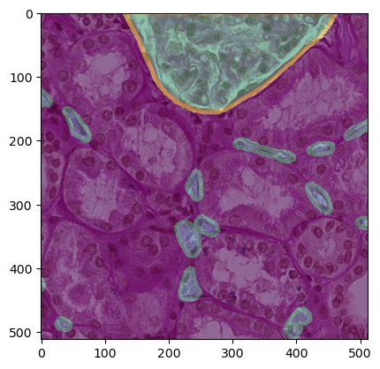
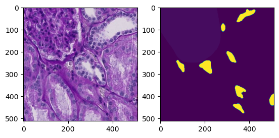
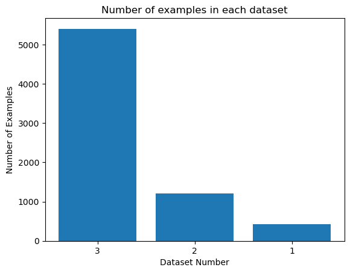
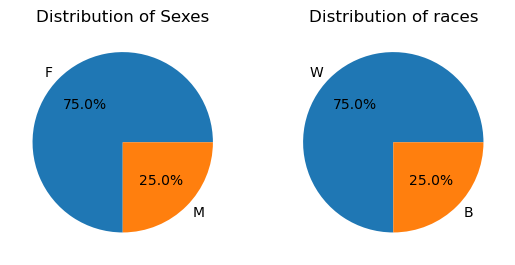
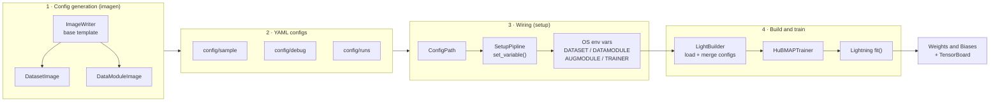
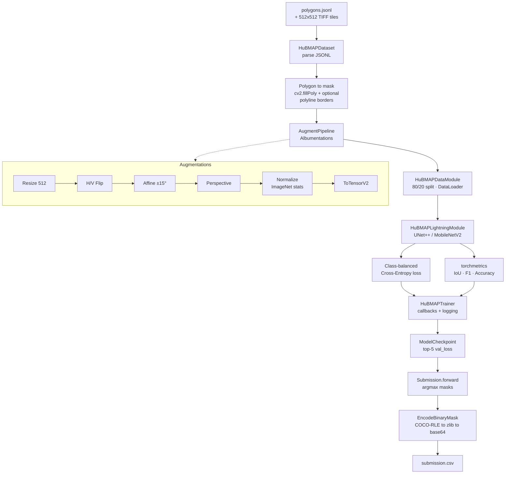
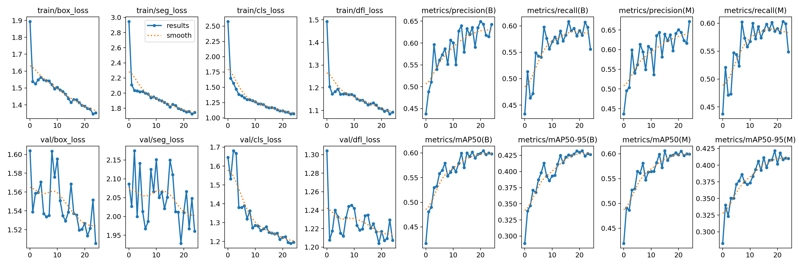
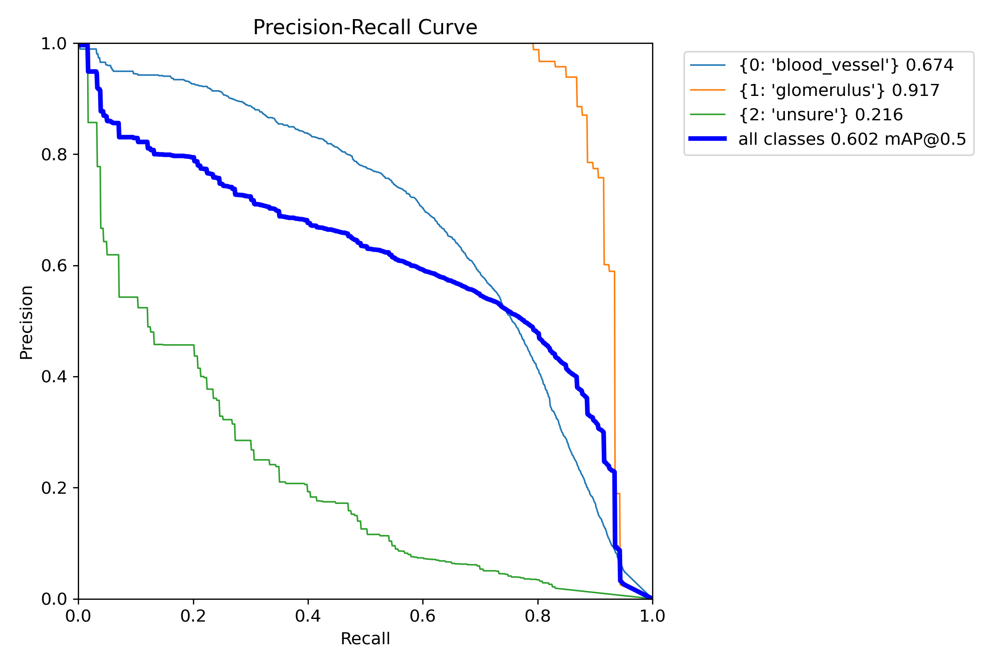

<div align="center">

# 🩸 HuBMAP — Hacking the Human Vasculature

### An applied research project on microvascular instance segmentation in human kidney histology

<em>Segmenting blood‑vessel structures in PAS‑stained renal tissue to help build the Vasculature Common Coordinate Framework (VCCF)</em>

<br/>

<!-- Result Card -->


</div>

> [!NOTE]
> **What this repository is.** An applied research project asking a concrete question: *what actually finds microvascular structures (blood vessels) in stained kidney histology, and does the answer hold up on slides the model has never seen?* It carries the work from a clinical motivation through method design, experiments across two model families, and honest conclusions about what generalizes. The research rests on real engineering: a modular, YAML‑configurable PyTorch Lightning pipeline for data modelling, polygon→mask rasterization, augmentation, training, experiment tracking, and competition‑format submission encoding. The engineering exists to keep the experiments reproducible and comparable, not as an end in itself.
>
> **How the work is organized.** Two complementary parts. The [competition notebooks](notebooks/) are where the investigation actually happens: exploratory analysis, two model families (**Mask R‑CNN** and **YOLOv8x‑seg**), hyperparameter sweeps, and graded submissions. The config‑driven Lightning framework (UNet++ / MobileNetV2) is the apparatus built to make that experimentation repeatable. Together they trace one line of inquiry end to end.
>
> **On results.** The best selected public score was **AP @ IoU 0.6 = 0.3317**. Every number in this README traces back to a primary artifact: the official Kaggle submission export, the saved training runs (`results.csv`), the notebooks' own executed outputs, or the [official competition pages](https://www.kaggle.com/competitions/hubmap-hacking-the-human-vasculature). Nothing is invented to look impressive, and where a notebook's own internal metric is unreliable, that is called out plainly. See **[Results & Experiments](#-results--experiments)**.

---

## 📑 Table of Contents

- [Abstract](#-abstract)
- [Clinical Problem & Significance](#-clinical-problem--significance)
- [Dataset](#-dataset)
- [Evaluation Metric](#-evaluation-metric)
- [System Design](#-system-design)
- [Pipeline Architecture](#-pipeline-architecture)
- [Class Architecture](#-class-architecture)
- [Methodology Deep‑Dive](#-methodology-deep-dive)
- [Domain Formulas](#-domain-formulas)
- [Notebooks & Experiments](#-notebooks--experiments)
- [Results & Experiments](#-results--experiments)
- [Repository Structure](#-repository-structure)
- [Reproduce](#-reproduce)
- [References](#-references)

---

## 🧭 Abstract

The proper functioning of human organs depends on the spatial organization of ~37 trillion cells. Mapping them requires a navigation system, and the **Vasculature Common Coordinate Framework (VCCF)** uses the body's blood vasculature, right down to individual capillaries, as that coordinate system. Gaps in our knowledge of **microvasculature** therefore translate directly into gaps in the VCCF. The HuBMAP 2023 competition asked participants to **automatically segment microvascular structures (blood vessels)** in Periodic acid‑Schiff (PAS) stained whole‑slide images of healthy human kidney.

The question this project studies is a practical one: which method reliably segments those vessels, and how far does its measured performance survive the jump from training tiles to unseen slides. To keep that investigation honest, the work is built on a **config‑driven training apparatus**. It rasterizes polygonal annotations into semantic (or instance) masks, applies a reproducible Albumentations pipeline, trains a `segmentation-models-pytorch` **UNet++ / MobileNetV2** network under **PyTorch Lightning** with class‑balanced cross‑entropy, tracks IoU, F1 and accuracy via `torchmetrics`, and encodes predictions in the competition's **COCO‑RLE, zlib, base64** submission format. The aim was a maintainable, template‑generated system that makes runs comparable and reproducible rather than a single throwaway notebook.

The empirical core lives in a set of **[curated notebooks](notebooks/)** that carry the study from EDA and data engineering through training sweeps to offline submission, across two model families: **Mask R‑CNN** (torchvision ResNet50‑FPN) and **YOLOv8x‑seg**. The best public score was **AP @ IoU 0.6 = 0.3317**, and locally YOLOv8x‑seg reached **Mask mAP@50 = 0.690** on the scored `blood_vessel` class. The [Results & Experiments](#-results--experiments) section reports these with full provenance, including a candid analysis of why the local numbers ran well ahead of the leaderboard.

---

## 🔬 Clinical Problem & Significance

| | |
|---|---|
| **Disease area** | Renal (kidney) tissue architecture — nephrology / digital pathology |
| **Modality** | Whole‑Slide Images (WSI) of **PAS‑stained** histology, tiled to 512×512 |
| **Target biology** | **Microvasculature** — arterioles, capillaries and venules within the renal cortex/medulla |
| **Why it matters** | Microvessels are the *addressing system* of the VCCF; segmenting them fills the gaps needed for a **Human Reference Atlas (HRA)** |

Renal tissue contains **glomeruli** (balls of capillary loops that begin the nephron) and a dense network of **peritubular capillaries** and **vasa recta**. Reliable, automated delineation of these vessels from stained tissue lets researchers turn raw slide data into structured, machine‑readable vascular maps — a prerequisite for studying how cell‑to‑cell relationships affect health. In this competition, `glomerulus` regions are explicitly **excluded** (predictions overlapping them count as false positives), and ambiguous structures are marked `unsure`.

<div align="center">

&nbsp;&nbsp;

<br/>
<sub><em>Left: a 512×512 PAS‑stained kidney tile with its blood‑vessel mask overlaid. Right: image and the mask rasterized from polygon annotations. Rendered by this project's notebooks on the competition sample data.</em></sub>
</div>

---

## 🗂 Dataset

The competition data comprises tiles extracted from **14 Whole‑Slide Images** and organized into three datasets:

| Dataset | WSIs | Annotations | Purpose |
|---|---|---|---|
| **Dataset 1** | subset of 5 | **Expert‑reviewed** polygons | Primary supervised signal; all test tiles originate here |
| **Dataset 2** | same 5 WSIs | Sparse, **not** expert‑reviewed | Extra (noisy) supervision / pretraining |
| **Dataset 3** | 9 additional WSIs | **Unannotated** | Semi‑/self‑supervised opportunities |

**Data split of the 5 annotated WSIs:** 2 train · 2 public test · 1 private test. There are **~650 tiles** in the full hidden test set (this is a Kaggle **code competition**).

**Observed in this project's data loading:**

| Quantity | Value | Source |
|---|---|---|
| Total tiles (`tile_meta.csv`) | **7,033** | notebook output |
| Annotated images (`polygons.jsonl`) | **1,633** | notebook output |
| Tile size | **512 × 512**, TIFF | competition data page |
| Annotation classes | `blood_vessel` (target), `glomerulus` (excluded), `unsure` | `polygons.jsonl` |
| Donor metadata | age, sex, race, height, weight, BMI (`wsi_meta.csv`) | notebook EDA |

<div align="center">

&nbsp;&nbsp;

<br/>
<sub><em>Left: number of tiles per dataset. Right: donor sex/race distribution across the annotated WSIs. Aggregate statistics only — no patient‑identifiable data.</em></sub>
</div>

> [!IMPORTANT]
> **No competition data, medical images, or model weights are committed to this repository.** The `data/`, `models/`, and `env/` directories are git‑ignored. The tiles shown above are figures rendered by the project's own notebooks; the raw dataset must be obtained from Kaggle under its own license.

---

## 📐 Evaluation Metric

Submissions are scored by **Average Precision (AP) over confidence scores**, computed exactly as in the **OpenImages Instance Segmentation Challenge but with a single class** (`blood_vessel`). A predicted mask matches a ground‑truth mask when their **Intersection‑over‑Union ≥ 0.6** (a *single* IoU threshold, not a COCO‑style average over thresholds).

$$
\mathrm{IoU}(A, B) = \frac{\lvert A \cap B \rvert}{\lvert A \cup B \rvert}, \qquad
\mathrm{AP} = \sum_{n} \left( R_n - R_{n-1} \right) P_n
$$

where predictions are ranked by descending confidence, and $P_n$, $R_n$ are the precision and recall after the $n$‑th prediction. A prediction is a **true positive** when it matches an unclaimed ground‑truth vessel at $\mathrm{IoU} \ge 0.6$; predictions inside `glomerulus` regions are **false positives**.

---

## 🧱 System Design

The framework is built around a **template → config → environment → builder** flow. Nothing is hard‑coded: dataset semantics, augmentation, and trainer behaviour are all declared in YAML that is *generated* from Python "image" templates, then loaded and merged at runtime.



**Why this shape.** Separating *what to run* (YAML) from *how to run it* (builders) means a new experiment is a new config file, not a code edit. `sample` configs document the schema, `debug` configs run fast sanity checks (`fast_dev_run`, spatial augment previews), and `runs` configs carry real hyper‑parameters.

---

## 🧬 Pipeline Architecture

End‑to‑end flow from raw polygons to a competition submission:



---

## 🏛 Class Architecture

The codebase is organized into four cohesive packages — `imagen` (config templates), `setup` (paths/wiring), `lightning` (data + model + trainer), and `submission` (encoding). Key inheritance and composition:


---

## 🔧 Methodology Deep‑Dive

### Data modelling & mask rasterization
`HuBMAPDataset` parses `polygons.jsonl` and rasterizes each annotation with `cv2.fillPoly`. A **config head** switches behaviour:

- **`instance: false`** → all vessels are burned into a single **semantic** mask (label per class).
- **`instance: true`** → one mask **per** vessel, producing an instance target list.
- **`border` class** → optional `cv2.polylines` outline with configurable `thickness`; `multiborder` gives borders a distinct label. This lets the network learn to separate touching vessels — a classic trick for instance‑aware semantic segmentation.

A `DatasetValidator` mix‑in type‑checks every argument (paths, split ratio, stage) before construction — fail fast, fail loud.

### Augmentation
`AugmentPipeline` (Albumentations) composes: `Resize(512)` → `HorizontalFlip` → `VerticalFlip` → `Affine(rotate ±15°, reflect border)` → `Perspective(0.05–0.25)` → `Normalize(ImageNet mean/std)` → `ToTensorV2`. Spatial transforms are toggled by config; a `debug_mode` short‑circuits normalization so masks can be previewed via `DisplayAugment`.

### Model & training
- **Architecture:** `smp.UnetPlusPlus(encoder_name="mobilenet_v2", encoder_depth=5, classes=3)` — a UNet++ decoder over a lightweight MobileNetV2 encoder (background / blood_vessel / border).
- **Loss:** `CrossEntropyLoss` with **per‑batch class weights** from `sklearn.utils.class_weight.compute_class_weight("balanced", …)`, addressing the heavy background‑vs‑vessel imbalance.
- **Metrics:** `torchmetrics` **JaccardIndex (IoU, macro)**, **FBetaScore (F1, micro)**, **Accuracy (micro)**.
- **Optimizer / schedule:** **Adam** + **ReduceLROnPlateau** (`patience=5`, monitors `val_loss`).
- **Callbacks:** `ModelCheckpoint` (top‑5 by `val_loss`), `EarlyStopping` (`patience=5`), `LearningRateMonitor`.
- **Trainer:** PyTorch Lightning, TF32 matmul (`precision="medium"`), `max_epochs=115`, `min_epochs=15`, seeded for determinism.
- **Tracking:** Weights & Biases (`wandb.watch`) + TensorBoard.

### Submission encoding
`EncodeBinaryMask` converts each predicted binary mask to Fortran‑order `uint8`, encodes it with the **COCO mask RLE API**, **zlib**‑compresses (best compression), and **base64**‑encodes it — emitting the required `0 {confidence} {EncodedMask}` prediction strings into `submission.csv`.

> [!WARNING]
> **Honest scope.** The `Submission` class in the framework ships with a `SampleModel` that emits random masks, a working I/O harness rather than a trained predictor (the trained models live in the notebooks). The winning solutions for this competition leaned on **detection and instance‑segmentation** frameworks (RTMDet, YOLOv8‑seg, Mask R‑CNN / HTC / DetectoRS via MMDetection and Detectron2) with heavy ensembling. This project studies that space from a semantic‑segmentation starting point and documents where it holds and where it falls short.

---

## 🧮 Domain Formulas

The loss and metrics **actually used** in `HuBMAPLightningModule`:

**Class‑balanced Cross‑Entropy** (per‑batch `balanced` weights, softmax over $C$ classes):

$$
w_c = \frac{N}{C \cdot n_c}, \qquad
\mathcal{L}_{\mathrm{CE}} = -\frac{1}{N}\sum_{i=1}^{N} w_{y_i}\,\log\frac{e^{z_{i,y_i}}}{\sum_{c=1}^{C} e^{z_{i,c}}}
$$

**Jaccard Index / IoU** (segmentation overlap) and **Dice / F1** (harmonic mean of precision & recall):

$$
\mathrm{IoU} = \frac{\lvert A \cap B\rvert}{\lvert A \cup B\rvert}, \qquad
F_1 = \mathrm{Dice} = \frac{2\lvert A \cap B\rvert}{\lvert A\rvert + \lvert B\rvert} = \frac{2PR}{P+R}
$$

**Competition score — Average Precision at $\mathrm{IoU} \ge 0.6$** (single class):

$$
\mathrm{AP} = \sum_{n}\left(R_n - R_{n-1}\right)P_n
$$

---

## 🧪 Notebooks & Experiments

The investigation ran along two complementary lines. The **Lightning framework** in this repo
(UNet++ / MobileNetV2, semantic) kept the experiments reproducible, while a set of
**[Kaggle notebooks](notebooks/)** iterated faster with off‑the‑shelf detection and instance
models. Seven curated notebooks cover the whole arc: EDA, data engineering, two model families,
and offline submission. Full per‑notebook write‑ups with exact numbers live in
**[`notebooks/README.md`](notebooks/README.md)**.

| # | Notebook | What it contributes |
|---|----------|---------------------|
| 01 | EDA & submission pipeline | dataset facts (7,033 tiles / 1,633 annotated) + COCO‑RLE encoder |
| 02 | Dataset → YOLO‑seg format | `polygons.jsonl` → YOLO labels, 1,306 / 327 split |
| 03 | Offline tools setup | internet‑banned install of `ultralytics` + `pycocotools` |
| 04 | Mask R‑CNN (torchvision) | ResNet50‑FPN, 10 epochs, val loss 1.185 → 0.946 |
| 05 | Mask R‑CNN from scratch | hand‑built loop; a documented **negative result** (LR‑schedule bug) |
| 06 | YOLOv8x‑seg | strongest line — Mask mAP@50 = 0.597; `blood_vessel` = 0.690 |
| 07 | YOLO inference & submission | offline `best.pt` → `submission.csv` |

---

## 📊 Results & Experiments

> [!NOTE]
> All figures below trace to primary artifacts: the official **Kaggle submission export**
> (`Competition-Submissions.csv`), the saved Ultralytics **`results.csv`** training logs, and the
> notebooks' own executed cell outputs. The hidden‑test leaderboard score is **AP at a single
> IoU = 0.6, single class** (`blood_vessel`). Local YOLO metrics are Ultralytics **Mask mAP@50 /
> mAP@50‑95** on an 80/20 split — a *different, more forgiving* measurement than the LB, which is
> exactly the point of the generalization analysis below.

### Public leaderboard timeline (real)

Reconstructed from the submission export; approach is attributed by date‑proximity to each
notebook's publication (the export records scores + timestamps, not notebook names).

| Date (2023) | Public AP @ 0.6 | Selected | Most likely source |
|---|---|---|---|
| 06‑25 | 0.168 → 0.209 | | early Mask R‑CNN drafts |
| **06‑26 16:15** | **0.3317** | ✅ **best** | **Mask R‑CNN (torchvision)** |
| 06‑26 20:23 | 0.2737 | ✅ | YOLOv8x‑seg |
| 06‑26 → 27 | 0.246 – 0.256 | | YOLO / Mask R‑CNN tuning |
| 07‑07 | 0.2737 | | YOLO submission notebook |

**Best selected: AP @ 0.6 = 0.3317.** The peak came from the Mask R‑CNN line; the YOLO line
plateaued on the LB around **0.27** despite stronger *local* validation — see the gap analysis.

### YOLOv8x‑seg hyperparameter sweep (local, from `results.csv`)

Four `yolov8x-seg` runs were saved (plus three earlier `yolov8n-seg` runs). Best epoch per run:

| Run | Optimizer | lr0 | close_mosaic | Best Mask mAP@50 | mAP@50‑95 | Epoch |
|---|---|---|---|---|---|---|
| 3 | SGD | 0.015 | 0 | 0.579 | 0.397 | 18 |
| 4 | **Adam** | 0.005 | 0 | 0.454 | 0.238 | 31 |
| 5 | SGD | 0.010 | 10 | 0.600 | 0.407 | 15 (← submitted `best.pt`) |
| 6 | SGD | 0.010 | 10 | **0.602** | **0.422** | 19 |

**What the sweep shows:** **SGD clearly beat Adam** (0.60 vs 0.45 Mask mAP@50 at the same scale);
turning mosaic off for the final epochs (`close_mosaic=10`) gave the best two runs; `yolov8x` ≫
`yolov8n`; and early stopping fired at epochs ~15–25 even with 100–200‑epoch budgets — fast
convergence, then plateau.

### YOLOv8x‑seg per‑class validation (20‑epoch documented run)

| Class | Val instances | Mask mAP@50 | Mask mAP@50‑95 |
|---|---|---|---|
| **blood_vessel** (scored) | 2,955 | **0.690** | 0.338 |
| glomerulus | 104 | 0.921 | 0.794 |
| unsure | 177 | 0.180 | 0.103 |
| **all** | 3,236 | 0.597 | 0.412 |

<div align="center">
  
  <br/><em>YOLOv8x‑seg training/validation curves (losses ↓, Box/Mask precision·recall·mAP ↑).</em>
  <br/><br/>
  
  <br/><em>Mask precision–recall by class (saved sweep run 6): <code>blood_vessel</code> 0.674, <code>glomerulus</code> 0.917, <code>unsure</code> 0.216, all‑classes mAP@50 0.602 — the target class carries the useful signal, <code>unsure</code> is near‑noise.</em>
</div>

### Mask R‑CNN (torchvision, 10 epochs)

Stable convergence — **train loss 1.319 → 0.924, val loss 1.185 → 0.946**, best at epoch 10
(~90 min). The notebook's *internal* mAP scorer is **not trustworthy**: its IoU sweep is
`np.arange(0.6, 6.5, 0.05)` (upper bound 6.5 instead of ~0.95), averaging in dozens of impossible
thresholds and collapsing the number toward zero. The trustworthy signal here is the loss curve and
the resulting **0.3317** public score, not that internal metric. The hand‑built *from‑scratch*
variant (notebook 05) **plateaued** (val `loss_mask` ≈ 0.53, early‑stopped at epoch 8) — traced to
`StepLR.step()` being called per‑batch, which zeroes the LR within one epoch. A clean, documented
negative result.

### The generalization gap (the central lesson)

Local YOLO `blood_vessel` Mask mAP@50 was **0.690**, but the hidden‑test LB was **~0.27**. The
biggest driver is traceable in the data code: **the train/val split is an unshuffled index slice
that does not group by WSI**, so tiles from the same slide land on both sides — validation leaks
tissue‑ and stain‑level signal and overstates generalization. HuBMAP's Dataset 1/2/3 tiers and the
held‑out **private‑test WSI** (the "missing" WSI #5) make this domain shift the dominant risk. A
**group‑aware (per‑WSI) split** is the first fix any next iteration should make.

### What worked / what didn't

**Worked**
- **YOLOv8x‑seg + SGD + `close_mosaic`** — the best, most stable line (0.60 Mask mAP@50 locally).
- **Transfer learning** from COCO weights for both families; Mask R‑CNN converged smoothly in 10 epochs.
- **Offline submission plumbing** — building `pycocotools`/`ultralytics` from attached datasets for internet‑banned kernels; the **COCO‑RLE → zlib → base64** encoder verified end‑to‑end before any real model.

**Didn't**
- **Adam** underperformed SGD by a wide margin on this task.
- **Mask R‑CNN from scratch** plateaued on a per‑batch LR‑schedule bug.
- The **`unsure` class is near‑noise** (Mask mAP@50 = 0.180) and dilutes multi‑class training even though it is excluded from the metric.
- **Local ≫ LB** because the split ignores WSI boundaries — the single biggest thing to fix.
- Runs stopped early with epoch budget left (`patience` fired) — **headroom untapped**.

### Framework track — metrics it instruments

The Lightning framework logs these per epoch to W&B / TensorBoard. (Its UNet++/MobileNetV2 head was
trained too — a referenced checkpoint tag reads `epoch=2_val_loss=0.20_val_accuracy=0.96`; note
that **pixel accuracy is inflated by background dominance** and is not the competition metric.)

| Signal | Implementation | Averaging |
|---|---|---|
| Loss | Class‑balanced Cross‑Entropy | mean over steps |
| IoU | `torchmetrics.JaccardIndex` | macro |
| F1 | `torchmetrics.FBetaScore(β=1)` | micro |
| Accuracy | `torchmetrics.Accuracy` | micro |
| Empty‑target count | custom counter | per epoch |

**Conclusions from the build**

- A **template‑driven config system** (`imagen` → YAML → env vars → `LightBuilder`) makes experiments declarative and diff‑friendly — the strongest part of this design.
- The metric mismatch matters: **AP @ IoU 0.6 rewards well‑separated instances**, which favours the detection/instance frameworks (Mask R‑CNN, YOLOv8) over a 3‑class semantic mask — borne out by the scores above.
- The next‑iteration shortlist writes itself from the evidence: **group‑aware per‑WSI split**, **drop `unsure`**, **train YOLOv8x longer** (patience never let it finish), and a **Dice/Tversky or focal** objective for the semantic head.

---

## 🗃 Repository Structure

```
HuBMAP/
├── main.py                     # Entry point: build UNet++/MobileNetV2 + HuBMAPTrainer.fit()
├── augrun.py                   # Visualize the augmentation pipeline (DisplayAugment)
├── imarun.py                   # Generate YAML config templates from imagen writers
├── initrun.py                  # Scaffold a new project (data/models/config dirs)
├── requirements.txt
├── config/
│   ├── sample/                 # Self-documenting schema templates
│   ├── debug/                  # Fast sanity-check configs (fast_dev_run, spatial aug)
│   └── runs/                   # Real hyper-parameters (datamodule/dataset/aug/trainer)
├── imagen/                     # Config "image" template generators
│   ├── imagewriter.py          # ImageWriter base
│   └── images/                 # DatasetImage, DataModuleImage
├── setup/
│   └── pipline.py              # ConfigPath + SetupPipline (paths, seeding, env wiring)
├── lightning/
│   ├── dataset/                # HuBMAPDataset + DatasetValidator (polygon→mask)
│   ├── datamodule/             # HuBMAPDataModule (split, DataLoaders)
│   ├── augmentations/          # AugmentPipeline + DisplayAugment / MaskDecoder
│   ├── lightmodule/            # HuBMAPLightningModule (loss, metrics, optim)
│   ├── lightbuilder/           # LightBuilder (config load + merge + W&B init)
│   └── trainer/                # HuBMAPTrainer (callbacks, logger, Trainer)
├── submission/
│   └── submit.py               # EncodeBinaryMask, Submission, SampleModel
├── initproject/                # InitialProject scaffolder
└── notebooks/                  # Curated Kaggle notebooks (see notebooks/README.md)
    ├── README.md                # Per-notebook write-ups with exact, traceable numbers
    ├── 01-eda-and-submission-pipeline.ipynb
    ├── 02-dataset-to-yolo-seg-format.ipynb
    ├── 03-offline-tools-setup.ipynb
    ├── 04-mask-rcnn-torchvision.ipynb
    ├── 05-mask-rcnn-from-scratch-pipeline.ipynb
    ├── 06-yolov8-instance-segmentation.ipynb
    └── 07-yolo-inference-and-submission.ipynb
```

---

## ⚙️ Reproduce

> The competition dataset is **not** included and must be downloaded from Kaggle under its license:
> <https://www.kaggle.com/competitions/hubmap-hacking-the-human-vasculature/data>

```bash
# 1. Environment
python -m venv env && source env/bin/activate
pip install -r requirements.txt

# 2. Place the data (git-ignored)
#    data/hubmap-hacking-the-human-vasculature/{train, polygons.jsonl, ...}

# 3. Point ConfigPath.root_dirpath at your checkout (setup/pipline.py),
#    then generate / edit configs under config/runs/*.yaml

# 4. (optional) Preview the augmentation pipeline
python augrun.py --scrolls 5 --alpha 0.6

# 5. Train (UNet++ / MobileNetV2 via PyTorch Lightning)
python main.py
```

Environment: Python 3.10, PyTorch 2.0.1, PyTorch Lightning 2.0.3, `segmentation-models-pytorch` 0.3.3, Albumentations 1.3.1, `pycocotools` 2.0.6 (see `requirements.txt`).

---

## 📚 References

- **Competition** — [HuBMAP: Hacking the Human Vasculature (Kaggle, 2023)](https://www.kaggle.com/competitions/hubmap-hacking-the-human-vasculature) · Organizers: Addison Howard, Katherine Gustilo, Katy Börner, Ryan Holbrook, Yashvardhan Jain.
- **HuBMAP Consortium** — <https://hubmapconsortium.org> (NIH‑funded Human BioMolecular Atlas Program).
- **Metric** — [OpenImages Instance Segmentation evaluation](https://storage.googleapis.com/openimages/web/evaluation.html#instance_segmentation_eval).
- **UNet++** — Zhou et al., *UNet++: A Nested U‑Net Architecture for Medical Image Segmentation*, DLMIA 2018. [arXiv:1807.10165](https://arxiv.org/abs/1807.10165)
- **MobileNetV2** — Sandler et al., *MobileNetV2: Inverted Residuals and Linear Bottlenecks*, CVPR 2018. [arXiv:1801.04381](https://arxiv.org/abs/1801.04381)
- **segmentation‑models‑pytorch** — <https://github.com/qubvel/segmentation_models.pytorch>
- **PyTorch Lightning** — <https://lightning.ai> · **Albumentations** — <https://albumentations.ai>
- **Top solutions (context)** — [1st place · tascj (RTMDet)](https://github.com/tascj/kaggle-hubmap-hacking-the-human-vasculature) · [3rd place · Nischaydnk (MMDetection ensemble)](https://github.com/Nischaydnk/HubMap-2023-3rd-Place-Solution)

---

<div align="center">
<sub>Built with a focus on ML system design · No patient data or competition files are redistributed · Figures are the project's own notebook renders.</sub>
</div>
